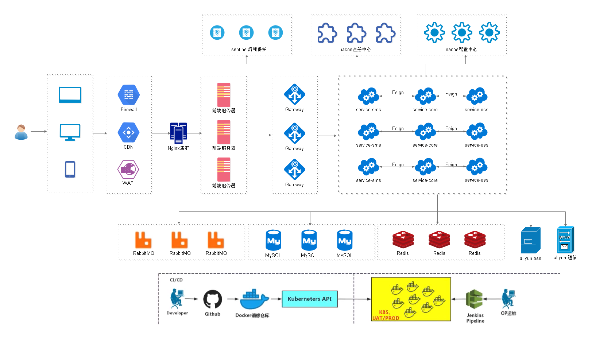
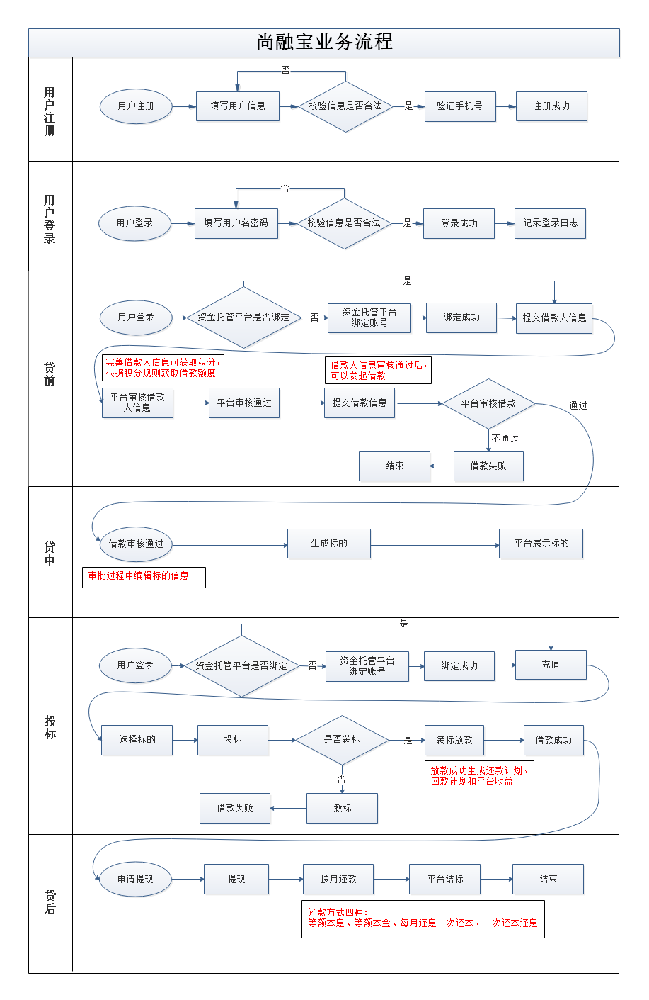
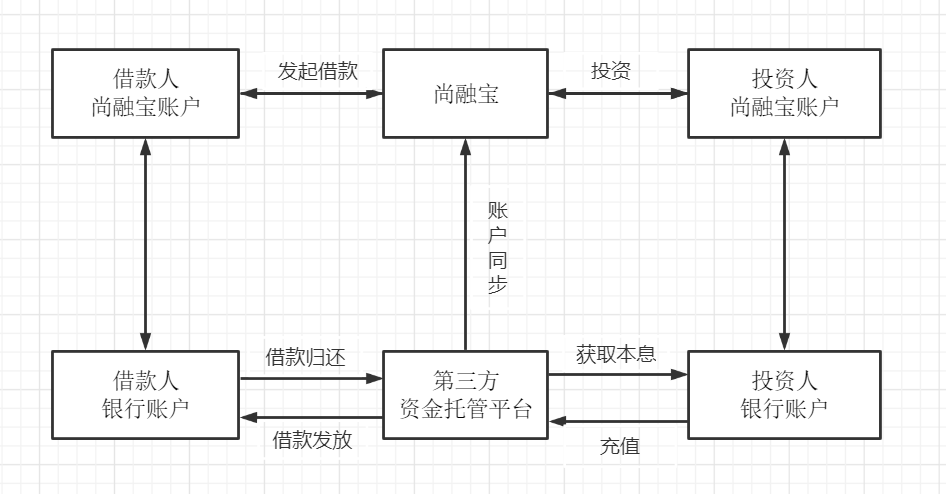

# finacialpotal
t-mac金融服务平台是一个网络借贷信息中介服务平台，为个人投资者、个人融资用户和小微企业提供专业的线上信贷及出借撮合服务。  
## 一.项目架构图  
  
## 二.业务流程介绍  
 
## 三.信用贷款平台的类别
### 银行系   
 
优势：第一，资金雄厚，流动性充足；  
第二，项目源质地优良，大多来自于银行原有中小型客户；  
第三，风险控制能力强。如恒丰银行、招商银行等旗下都有信用贷款平台。  
劣势：收益率偏低，预期年化收益率处于5.5%-8.6%之间，略高于银行其他理财产品，对投资人吸引力有限。  

### 国资系 
 优势:拥有国有背景股东的隐性背书，兑付能力有保障，业务模式较为规范，从业人员金融专业素养较高。  
 劣势:缺乏互联网基因；项目标的较大，起投门槛较高；且产品种类有限，多为企业信用贷；较为谨慎，层层审核的机制严重影响了平台运营效率；收益率不具有吸引力。  
 ### 民营系  
  民营系平台数量最多，起步最早，但鱼龙混杂，风险较高。  
  优势:普惠金融，手续便捷；门槛极低，投资起点低最低起投门槛甚至50元；强大的互联网思维，产品创新能力高，市场化程度高；收益率高，投资收益率具有吸引力。
  劣势:风险偏高，资本实力及风控能力偏弱，跑路及倒闭的高发区。
## 四.业务流程  
   
### 1.投资人  
希望在平台上找到合适的投资项目，获取利润回报的用户。  
### 2.借款人  
需要资金周转的用户  
#### 3.资金托管平台   
第三方存管模式：“第三方存管”的全称是“客户交易结算资金第三方存管”。  
这里的第三方存管机构，目前是指具备第三方存管资格的商业银行。  
银行的流入资金成本低，风控体系较完善。  

##五.所用技术
#### 1. 后端
|后端技术栈|版本号|使用|  
 |:---:|:---:|:---|
 |SpringBoot| 2.3.4.RELEASE|后端整体框架|  
 |SpringCloud| Hoxton.SR8| 微服务基础设施|
 |SpringCloud Alibaba|2.2.2.RELEASE|阿里的微服务框架|  
 |MyBatis Plus|3.4.1|持久层框架和代码生成器|
 |Lombok|1.18.12|简化实体类开发|
 |Swagger2Api|2.9.2|接口文档生成工具|
 |Logback|3.9|日志系统|
 |alibaba-easyexcel|2.1.1|Excel读写|
 |Spring Data RedisSpring|2.3.4|项目中访问Redis缓存|
 |HTTPClient|4.5.1| 基于Http协议的客户端，用来实现远程调用|
 |Spring Task|2.10.1|定时任务|  
 
 #### 2.数据库和中间件    
 |数据库和中间件|版本号|使用|  
  |:---:|:---:|:---|
  |MySQL | 5.7|关系型数据库|
  |Redis| 5.0| 缓存技术 |
  |RabbitMQ |3.8|消息中间件|  
  
 #### 3.前端技术  
|前端技术|使用|  
 |:---:|:---:|
 |Node.js|JavaScript|
 |ES6|JavaScript的模块化版本|
 |axios |一个发送Ajax请求的工具| 
 |Vue.js|web 界面的渐进式框架|
 |Element-UI|前端组件库|
 |NPM|模块资源管理器|
 |vue-element-admin|基于Vue.js的后台管理系统UI集成方案|
 |NuxtJS|基于Vue.js构建的服务器端渲染应用的轻量级框架|     
 ## 六.启动方法  
 git clone 之后，用idea打开，并且通过maven将其所用的jar包下载好。并且将RabbitMq，mysql，修改配置文件。之后启动项目。  
 ## 七.业务细节和流程      
 1.[账户绑定](docs/账户绑定.md)   
 2.[申请额度贷款](docs/申请额度贷款.md) 
 
 ## 
该项目膨胀开发

 
    
 
 
       
 
 
  

  
